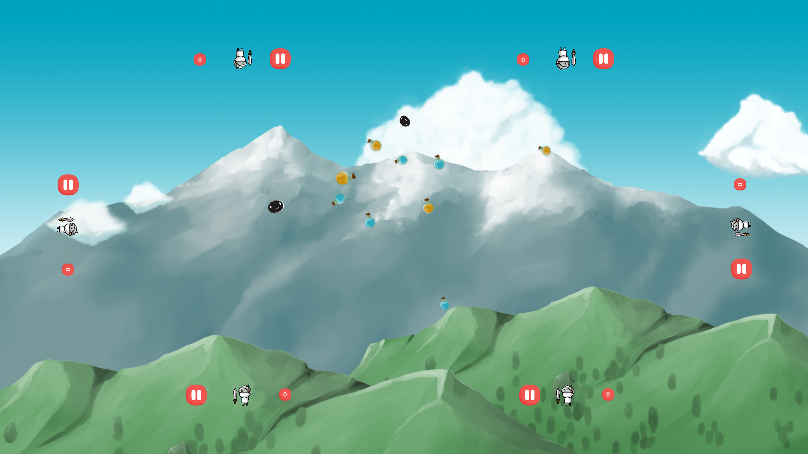

GrowthFactor
> GrowthFactor is an original concept multiplayer game designed for large touch devices.


GrowthFactor can be played with up to six players at a time. Each player tries to become the largest in the game by dragging food into their player from the game world. 

## Where to play

GrowthFactor will be available on a 65-inch touch table at Edmonton Public Library's downtown location once it opens in spring 2020.

A mobile version of GrowthFactor is under development for Android and Apple platforms.

## Development setup

Download Unity version 2019.2.6f1 

Clone the GrowthFactor repo: 

```sh
git clone https://github.com/DakotaDoolaege/GrowthFactor.git
```

Add the project to unity by clicking "ADD" and then selecting the cloned folder

## Team
[](https://github.com/DakotaDoolaege/GrowthFactor/graphs/contributors)
- [Arnoldo Marin](https://github.com/Barimir)
- [Dakota Doolaege](https://github.com/DakotaDoolaege)
- [Samuel Neumann](https://github.com/samuelfneumann)
- [Sean Casey](https://github.com/caseys88)


<!-- Links
https://shields.io/

-->
